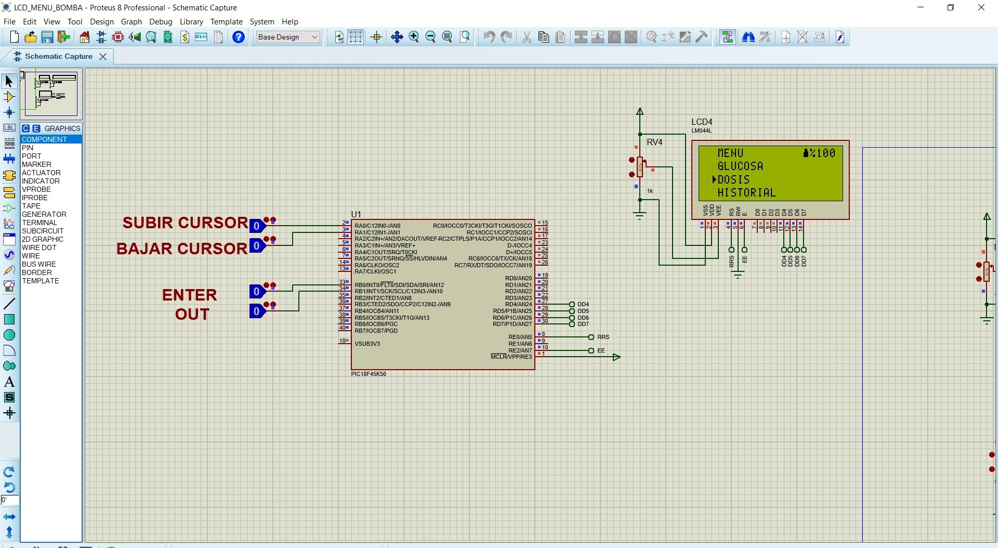
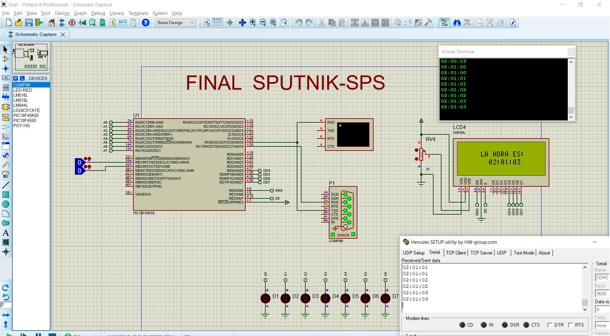

# PIC_ieee_sps
Curso de Microcontroladores PIC con XC8 y code configurator.

 *(imagenes de dos de los trabajos que se realizaron)*

MENU LCD

El menu esta hecho gracias a nuestra libreria LCD,tiene submenus y caracteres especiales

FINAL EUSART TIMMER INT

La interrupciones de baja prioridad permiten que aumenten y disminuyan las horas

